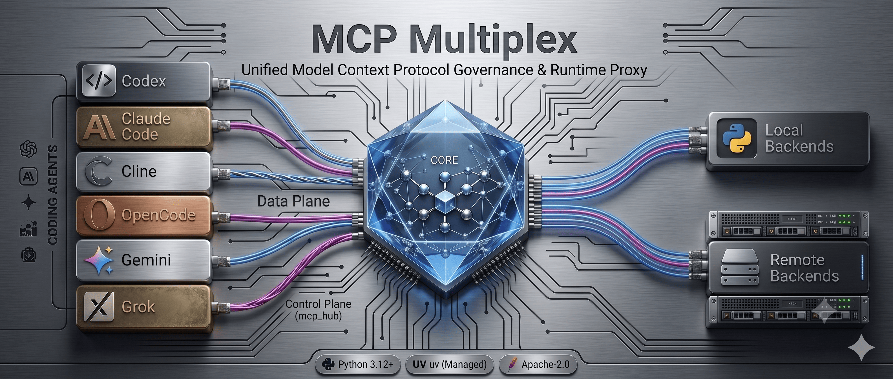
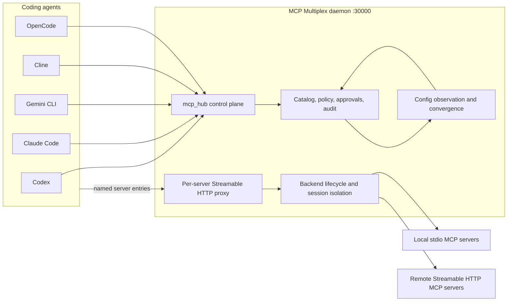

<p align="center">
  
</p>

[](https://github.com/AmeerJ97/mcp-multiplex/actions/workflows/ci.yml)
[](https://github.com/AmeerJ97/mcp-multiplex/actions/workflows/codeql.yml)
[](https://github.com/AmeerJ97/mcp-multiplex/actions/workflows/scorecard.yml)
[](LICENSE)
[](https://www.python.org/)
[](https://docs.astral.sh/uv/)

# MCP Multiplex

**Local governance and convergence for the Model Context Protocol.**

MCP Multiplex is a daemon-first local control plane, policy engine, catalog, and
runtime proxy for [Model Context Protocol](https://modelcontextprotocol.io)
servers used by coding agents. It keeps named MCP server entries intact while
continuously converging supported client configurations toward a governed,
auditable, and reversible state.

> **Status:** Beta. Linux is the primary supported platform. The repository has
> adapters and authenticated control-plane install paths for Codex, Claude Code,
> Gemini CLI, Cline, and OpenCode. Run `mxp agents self-check` on each target
> machine before enabling automatic remediation.

## Known Limitations

- Linux is the primary supported platform today.
- Real-client certification is machine- and client-version-specific.
- Automatic remediation should remain disabled until local self-check and
  release-gate commands pass on the target machine.
- Enterprise fleet management, centralized policy distribution, SSO/RBAC, and
  hosted administration are outside the open source core.

## Why MCP Multiplex

Coding agents often maintain separate MCP configurations. Over time, those
files drift: the same server is duplicated, direct bypasses reappear,
credentials are embedded inconsistently, and local server processes are
started without a shared policy or audit trail.

MCP Multiplex provides one local governance layer:

- **Catalog once:** normalize known MCP servers into a durable catalog.
- **Preserve names:** keep normal per-server entries in every supported agent.
- **Converge continuously:** observe client configs and detect direct bypasses.
- **Plan before writing:** produce exact diffs, policy reasons, and approvals.
- **Mutate reversibly:** back up original bytes, verify writes, and support
  exact rollback.
- **Start on demand:** launch local stdio or remote Streamable HTTP backends only
  when a client needs them.
- **Share only when certified:** isolate or pool backend sessions according to
  catalog policy.
- **Reference secrets:** store credential references and resolve values only
  when an active backend starts.
- **Explain state:** expose health, plans, approvals, runtime state, and audit
  history through `mxp`, the operator REPL, and the `mcp_hub` control MCP.

## Installation

MCP Multiplex requires Python 3.12 or newer. Install
[uv](https://docs.astral.sh/uv/getting-started/installation/) first.

### From Git

```bash
uv tool install git+https://github.com/AmeerJ97/mcp-multiplex.git
mxp --version
```

With `pipx`:

```bash
pipx install git+https://github.com/AmeerJ97/mcp-multiplex.git
```

### From A Clone

```bash
git clone https://github.com/AmeerJ97/mcp-multiplex.git
cd mcp-multiplex
uv sync --locked --dev
uv run mxp --help
```

To install the current checkout as a global editable tool:

```bash
uv tool install --editable .
```

## Quick Start

### 1. Inspect The Local Environment

```bash
mxp config discover
mxp status --json
mxp audit run
```

Observation and planning commands are read-only. Agent config files are treated
as observed projections, not as the source of truth.

### 2. Install The User Daemon

Review the dry-run first:

```bash
mxp daemon install-user-service --home "$HOME"
```

Apply the reviewed unit, then enable it explicitly:

```bash
mxp daemon install-user-service --home "$HOME" --apply
systemctl --user daemon-reload
systemctl --user enable --now mcp-multiplex.service
mxp daemon status --home "$HOME"
mxp health
```

The default listener is local-only at `127.0.0.1:30000`.

### 3. Install The Agent Control Plane

Every supported client receives a named `mcp_hub` entry. Install is dry-run by
default:

```bash
mxp agents auth-capabilities
mxp agents install-control-plane --agent codex --home "$HOME"
mxp agents install-control-plane --agent codex --home "$HOME" --apply
mxp agents self-check --agent codex --home "$HOME"
```

Supported agent values are:

```text
codex
claude_code
gemini
cline
opencode
```

MCP Multiplex writes environment-variable references or helper paths, not raw
bearer tokens, into durable client configuration. `--emit-token` intentionally
reveals a newly issued token in command output and should be used only in a
controlled shell so the value can be placed in a secret manager or protected
process environment.

### 4. Review And Apply Plans

```bash
mxp plan list
mxp approval list
mxp plan show <plan-id>
mxp approval approve <approval-id>
mxp apply <plan-id>
mxp rollback <backup-id>
```

Destructive, ambiguous, unknown, project-shared, and unmanaged-process actions
remain approval-gated.

## Architecture



The daemon is the source of truth. The CLI, REPL, and `mcp_hub` are operator or
agent-facing control surfaces over the same durable state.

## Data Plane Contract

Each server keeps a distinct MCP entry and URL:

```text
http://127.0.0.1:30000/servers/<server>/mcp
```

For example:

```text
http://127.0.0.1:30000/servers/context7/mcp
```

The proxy implements MCP JSON-RPC over Streamable HTTP, including initialization,
frontend session IDs, request ID rewriting, lifecycle notifications, explicit
session deletion, cancellation forwarding, backend crash recovery, and
policy-controlled reuse. See the official
[MCP transport specification](https://modelcontextprotocol.io/specification/2025-11-25/basic/transports).

MCP Multiplex does not replace all data-plane tools with one omnibus server.
Agents continue to see normal named MCP servers.

## Control Plane Contract

The control-plane MCP is a separate named entry:

```text
mcp_hub
```

Its endpoint is:

```text
http://127.0.0.1:30000/servers/mcp_hub/mcp
```

It supports the MCP initialization lifecycle, session IDs, bodyless `202`
notification acknowledgements, protocol-version consistency checks,
authenticated `tools/list`, authenticated `tools/call`, and session deletion.
Its tools are read-only and scoped to the authenticated agent:

```text
self_check
status
plan_list
plan_show
proxy_url
runtime_status
credential_status
catalog_search
```

It intentionally does not expose direct apply, rollback, or process-kill tools.
See [Control-Plane Protocol Status](docs/CONTROL_PLANE_STATUS.md).

## Supported Agents

| Agent | Config strategy | Control token strategy |
| --- | --- | --- |
| Codex | Streamable HTTP URL | `bearer_token_env_var` |
| Claude Code | Streamable HTTP URL | `headersHelper` reads the environment |
| Gemini CLI | Remote `httpUrl` | Environment-backed header template |
| Cline | Governor-owned `mcp-remote` helper | Runtime environment header |
| OpenCode | Remote MCP URL | `{env:...}` header expansion |

The adapters parse direct, disabled, Hub-routed, environment-bearing, and
unsupported-field fixtures. Automatic rewrites still require adapter
certification and policy approval. Client releases can change their config
formats, so machine-level readiness is authoritative:

```bash
mxp agents self-check --home "$HOME"
mxp doctor release-gate --home "$HOME"
```

## Operator REPL

`mxp tui --repl` provides a dependency-free, scriptable operator interface:

```text
MCP Multiplex
local MCP control plane // governed catalog // runtime proxy

mxp> dashboard
mxp> self-check
mxp> problems
mxp> approvals
mxp> candidates
mxp> runtime
mxp> credentials
mxp> rollback
mxp> cutover
mxp> quit
```

The same commands can be piped into the REPL for automation.

## Migrating From MCP Hub

Migration is deliberately staged:

```bash
mxp cutover dry-run --from mcp-hub --legacy-root /path/to/legacy-state
mxp cutover import-catalog \
  --from mcp-hub \
  --catalog-path ./mcp-hub-catalog.json
mxp doctor release-gate --global-cutover --home "$HOME"
mxp cutover apply \
  --from mcp-hub \
  --confirm-retire-mcp-hub \
  --home "$HOME"
mxp cutover status --check-gate --check-footprint --home "$HOME"
mxp doctor retirement-gate --home "$HOME"
```

The dry-run does not mutate source files or Governor state. Cutover records an
audited retirement decision but does not silently kill unmanaged processes or
delete a legacy repository. Remaining artifacts are reported as explicit
operator cleanup steps.

## Security Model

- Binds to loopback by default.
- Validates browser `Origin` headers to reduce DNS-rebinding risk.
- Separates control-plane authorization from data-plane routing.
- Uses agent-scoped control tokens and permission scopes.
- Stores credential references instead of raw values.
- Resolves only credentials needed by an active backend.
- Redacts secret-like audit payloads.
- Rejects credential-bearing or malformed remote URLs.
- Requires review for destructive or uncertain actions.
- Preserves pre-image bytes and hashes for rollback.

See [SECURITY.md](SECURITY.md) for private vulnerability reporting.

## Documentation

- [Architecture](docs/ARCHITECTURE.md)
- [Control-Plane Protocol Status](docs/CONTROL_PLANE_STATUS.md)
- [Real-Client Certification Evidence](docs/certifications/README.md)
- [MXP / CLI Guide](docs/MXP_CLI.md)
- [Schemas And Contracts](docs/SCHEMAS_AND_CONTRACTS.md)
- [Public Roadmap](docs/ROADMAP.md)
- [Release Process](docs/RELEASE.md)
- [Governance](GOVERNANCE.md)
- [Support](SUPPORT.md)
- [Public Release Notes](PUBLIC_RELEASE_NOTES.md)

The implementation, tests, current CLI help, and public documentation are
authoritative for released behavior.

## Open Core Direction

MCP Multiplex keeps the single-user local control plane, catalog, policy,
runtime proxy, adapters, CLI, and safety model open source under Apache 2.0.
Future commercial work may focus on team and enterprise needs such as fleet
management, centralized policy distribution, compliance reporting, SSO/RBAC,
managed hosting, and premium support.

## Development

```bash
uv sync --locked --dev
make check
make build
```

Individual commands:

```bash
uv run ruff format --check .
uv run ruff check .
uv run mypy src tests
uv run pytest -q --tb=short
uv build
```

Apply formatting with:

```bash
make format
```

See [CONTRIBUTING.md](CONTRIBUTING.md) before changing mutation, authentication,
credential, or runtime-sharing behavior.

## License

MCP Multiplex is licensed under the [Apache License 2.0](LICENSE).

MCP Multiplex is an independent project and is not presented as an official
Model Context Protocol implementation or project.
